
# My Identity
Name : **Dandy Arya Akbar**. 
NIM: **1313623028**. 
Class: **Bachelor's Of Computer Science 2023 A**. 

# AI Usage
> Explain how you use the AI to solve the assignment. Put all ***your used queries*** in this section & what kind of AI are you using. Declare not using AI if you didn't do this.  
- **I only used an AI LLM (Specifically **ChatGPT 5**) only to get a general understanding of what it is that I need to know of and what I need to do in general (to point me in the right direction) and to help me figure out how to submit the project for submission.**

Queries I used:

![**Algorithm SLOWCONVEXHULL(P) Input. A set P of points in the plane. Output. A list L containing the vertices of CH(P) in clockwise order. 1. E ← /0. 2. for all ordered pairs (p,q) ∈ P×P with p not equal to q 3. do valid ← true 3 Chapter 1 COMPUTATIONAL GEOMETRY 4. for all points r ∈ P not equal to p or q 5. do if r lies to the left of the directed line from p to q 6. then valid ← false. 7. if valid then Add the directed edge → pq to E. 8. From the set E of edges construct a list L of vertices of CH(P), sorted in clockwise order. I took this off of the Computational Geometry: Third Edition book because right now i'm quite literally in a Komputer Grafik lecture with my lecturer explaining something about convex and concave hulls???? How does this algorithm work???**](image.png)

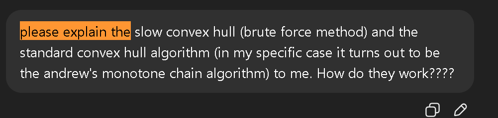
- 

- 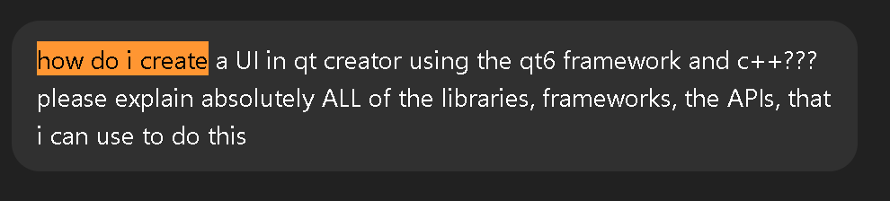

- 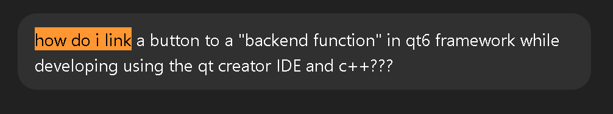

- 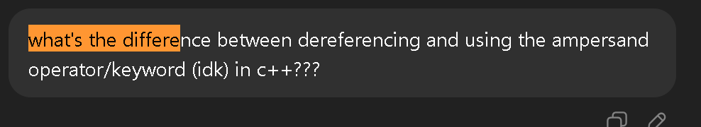

- 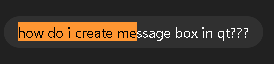

- 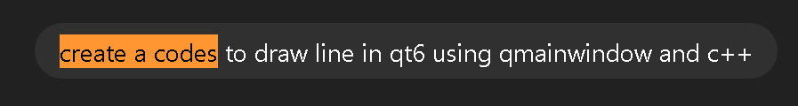

- 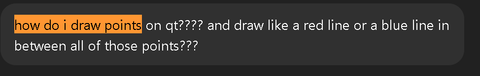

- 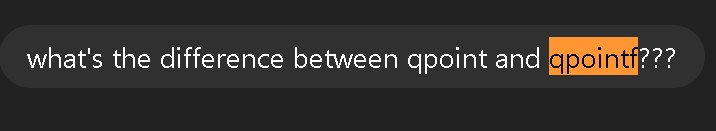

- ![**D:\university_life\Semester_5\komputer_grafik\ultimately_finalized_versions\convex-hull-assignment-SKYTEXCoder>git commit . On branch main Your branch is up to date with 'origin/main'. Untracked files: (use "git add <file>..." to include in what will be committed) CMakeLists.txt CMakeLists.txt.user build/ drawingcanvas.cpp drawingcanvas.h main.cpp mainwindow.cpp mainwindow.h mainwindow.ui nothing added to commit but untracked files present (use "git add" to track) D:\university_life\Semester_5\komputer_grafik\ultimately_finalized_versions\convex-hull-assignment-SKYTEXCoder>git add Nothing specified, nothing added. hint: Maybe you wanted to say 'git add .'? hint: Disable this message with "git config set advice.addEmptyPathspec false" D:\university_life\Semester_5\komputer_grafik\ultimately_finalized_versions\convex-hull-assignment-SKYTEXCoder>git add . error: open("build/Desktop_Qt_6_9_2_MinGW_64_bit-Debug/.cmake/api/v1/reply.prev/target-ConvexHullAlgorithmsSimulation_autogen_timest amp_deps-Debug-65262e80ee0578553438.json"): Filename too long error: unable to index file 'build/Desktop_Qt_6_9_2_MinGW_64_bit-Debug/.cmake/api/v1/reply.prev/target-ConvexHullAlgorithmsSimulatio n_autogen_timestamp_deps-Debug-65262e80ee0578553438.json' fatal: adding files failed alright how do i do this??? need to track everything and finally push them into the upstream repo**](image-9.png)

- 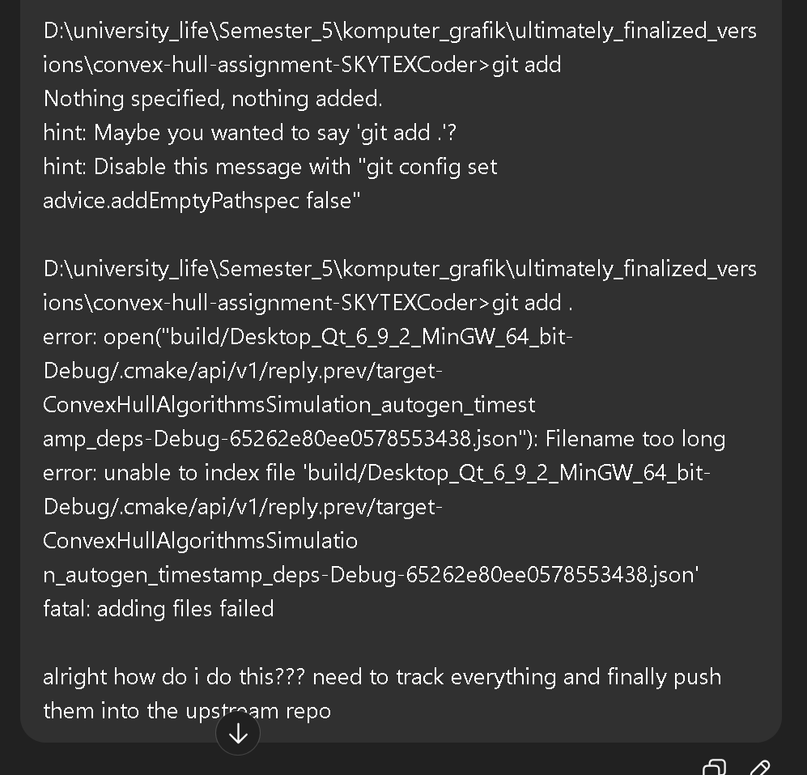

- 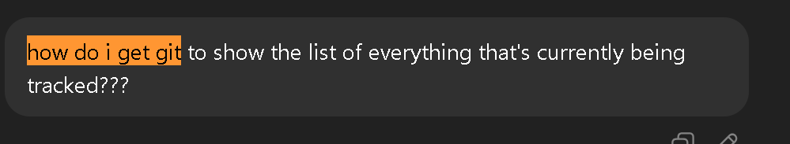

- 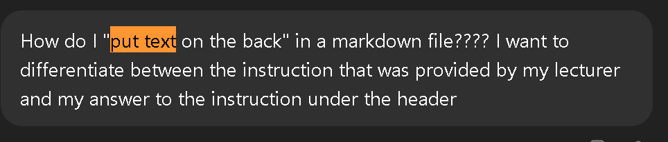

- 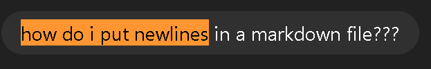

# Collaboration Usage
> Explain how you are ***using others*** to complete the assignment in this section. Are they simply copying, learn the ideas, learn how to adapt the AI or anything involving the process. State the people if any & Please be elaborate. Declare self tought if you solved this by yourself. 
- I did not collaborate with anyone, take advantage of, or use the knowledge of other people (e.g. my friends/classmates) in order to complete this assignment. So it's primarily self-taught all by myself and lots and lots of google searches and youtube videos.

# Commit Rules
Use .gitignore to stripe any binaries from the resulting build before commit.  If you cloned directly from the template, you are safe. 

# Due Time
September 30th, 2025. 23: 59 WIB
